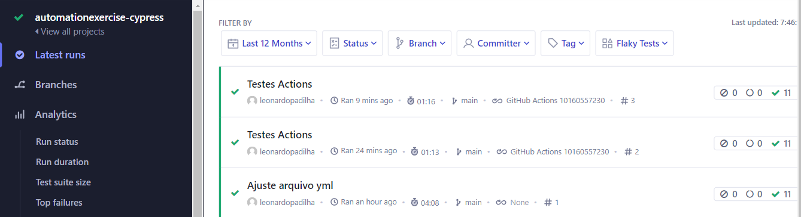
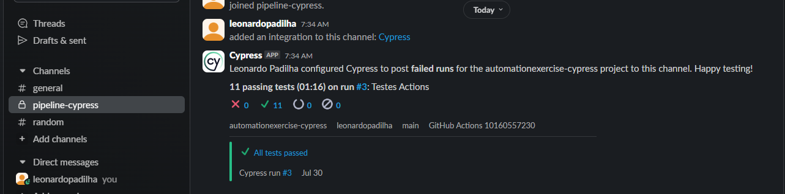
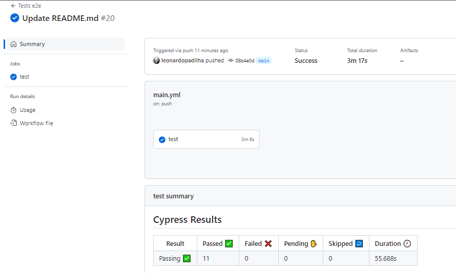

# Challenge - Automação Web

Automação de teste Web utilizando Cypress

## Tecnologias Utilizadas

[](https://nodejs.org/en)
[](https://mochajs.org/)
[](https://www.browserstack.com/)
[](https://www.cypress.io/)
[](https://docs.cypress.io/guides/cloud/introduction)
[](https://www.npmjs.com/package/cypress-mochawesome-reporter)
[](https://slack.com/intl/pt-br)
[](https://developer.mozilla.org/en-US/docs/Web/JavaScript)

## Descrição do Projeto

Este projeto foi desenvolvido com o objetivo de aprimorar os aprendizados em automação web utilizando cypress. A automação de testes visa garantir a qualidade e a funcionalidade do site, cobrindo cenários críticos e preparando a base para a expansão futura dos testes.

## Integrações

### Cypress cloud



### Slack



### GitHub Actions




## Instalação

Instalar as dependências

```bash
  npm install
```

## Execução dos testes via terminal

```bash
  npm run test
```

## Execução dos testes via tela

```bash
  npm run open
```

## Execução dos testes via Browserstack

<a href="https://automate.browserstack.com/dashboard/v2/builds/78b08ecaaa811a6253cb8abf7aa1bae2cc4fd1de/cypress-tests/tests/207cdf1499f75f93e01596a5edbb8f87f04decacY3lwcmVzcy9lMmUvYXV0b21hdGlvbi1leGVyY2lzZS1wb20uY3kuanM=?auth_token=0da169d5bb7cb18f9acc9ab73f660a0a14e0d96849faaded8489ee7e9200d219&build_token=WDJwS1dIOENzV00zTkdlYTk5Z2l6TTZFMzNyTFlieW9sRjNPcFlNRmtYVT0tLW04RG5sYzdMQTFHTDFXdWpNRXlIT3c9PQ==--26ebc01890940c4a7f1bd8fea00379426d537924 target=_blank">Visualização pública</a>

```bash
  npm run brows
```
